

  <a href="https://jetlag.gelbhart.dev">
    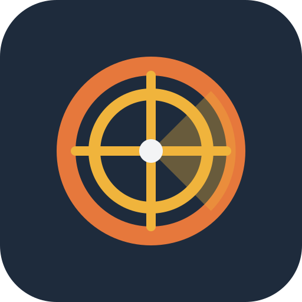
  </a>

<h1 align="center">Jet Lag Map Companion</h1>

  
  
  

Seekers ask questions on the live map. Hiders answer, set hiding zones, and watch the search unfold. Radar, zones, pins, and question tools stay in sync across the session.

**[Open the app →](https://jetlag.gelbhart.dev)**

  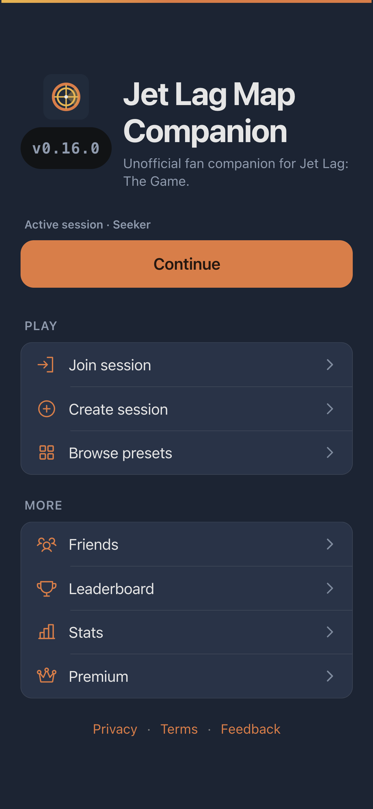
  &nbsp;
  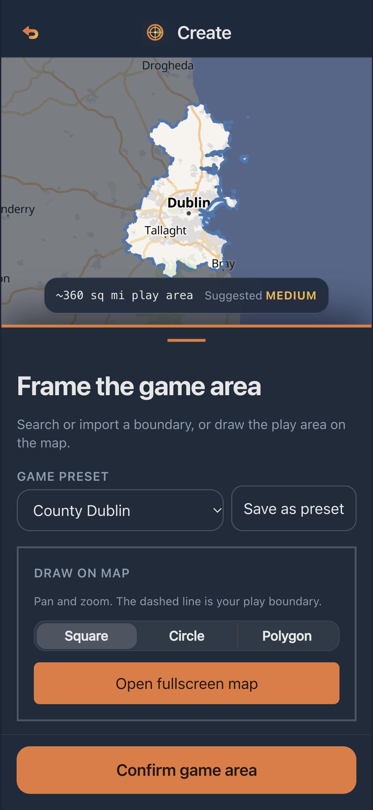
  &nbsp;
  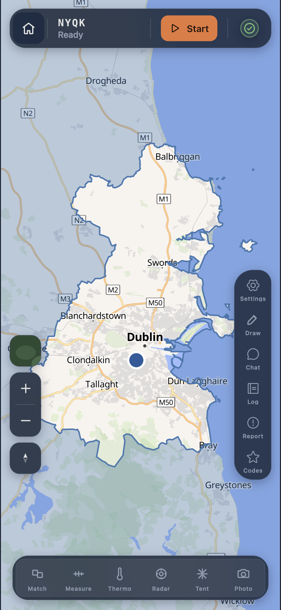
  &nbsp;
  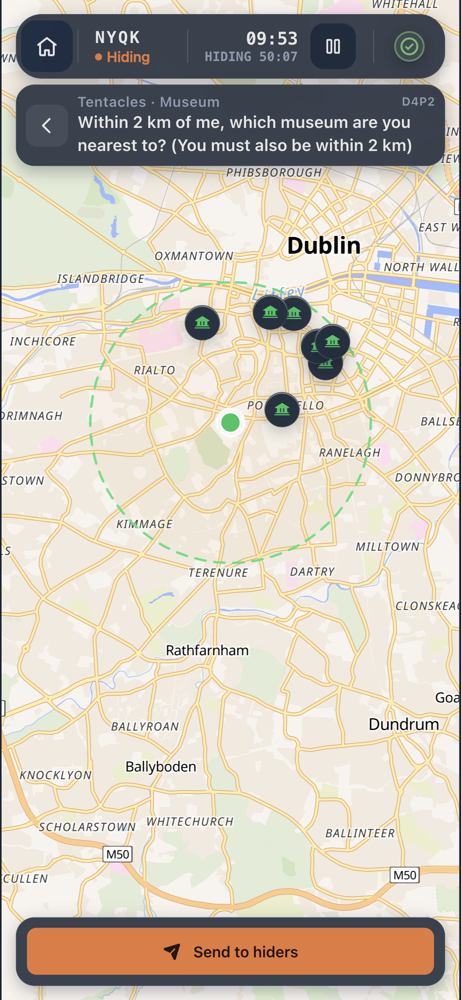
  &nbsp;

  
🗺️ Live map & session

  

    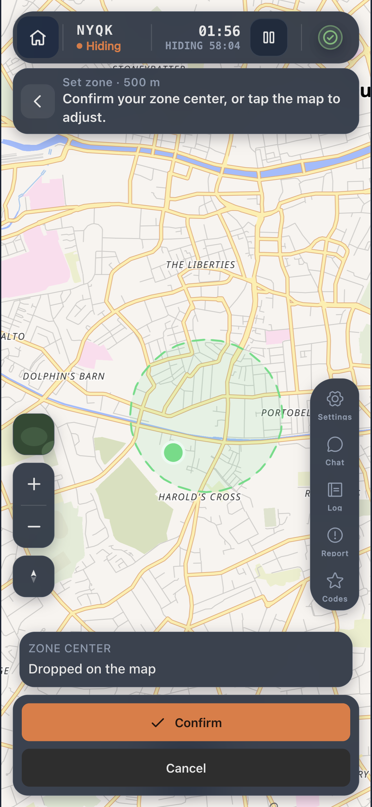
    &nbsp;
    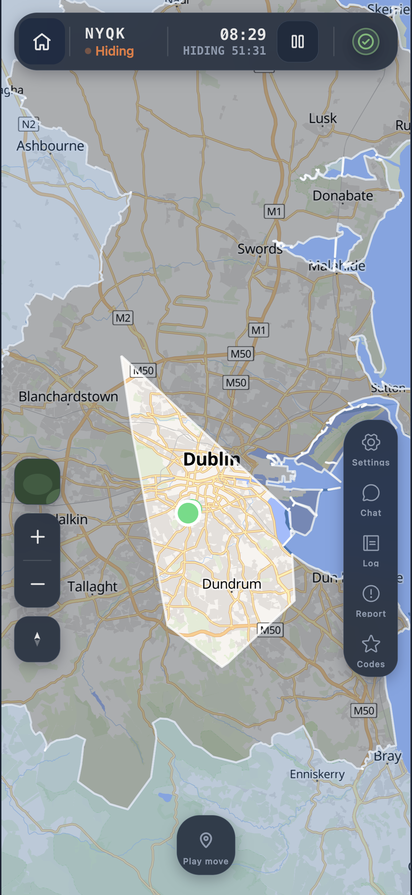
    &nbsp;
    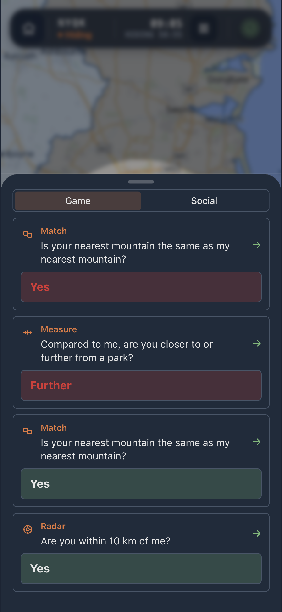
    &nbsp;
    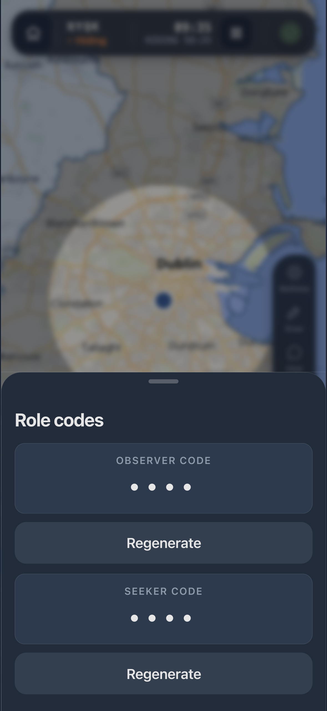
  

  
🎯 Ask tools

  

    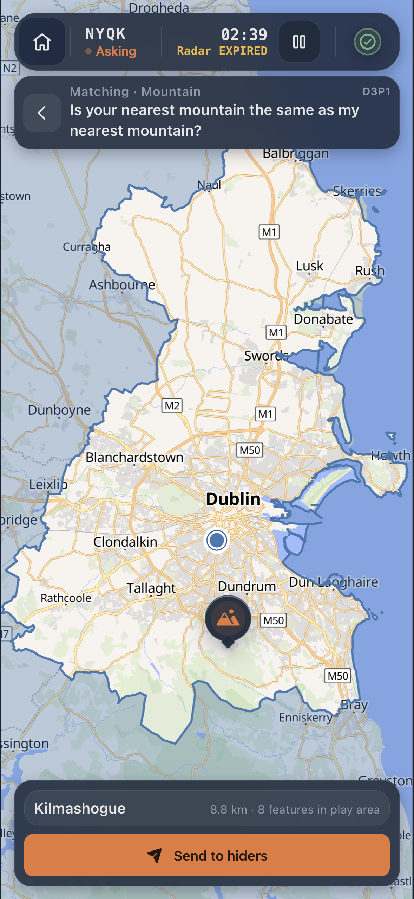
    &nbsp;
    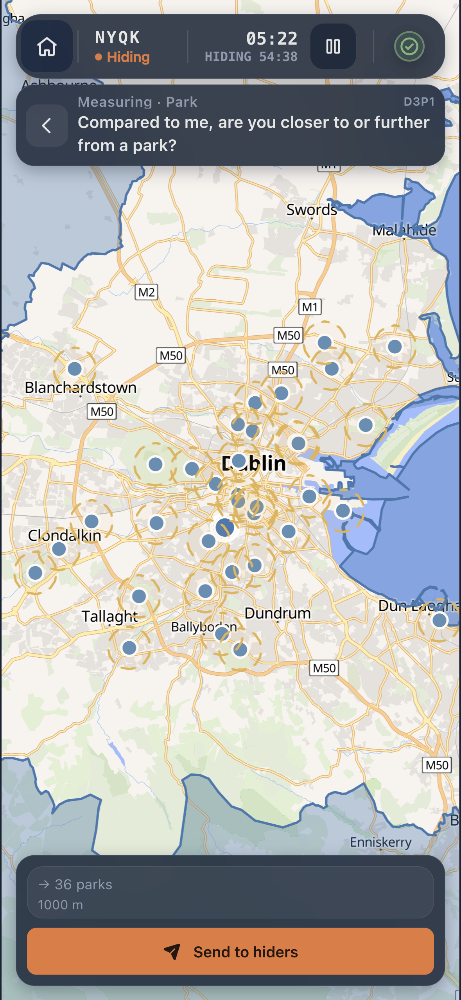
    &nbsp;
    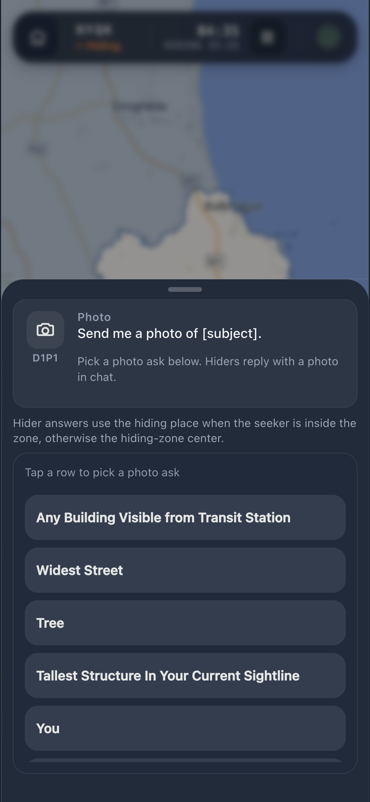
    &nbsp;
    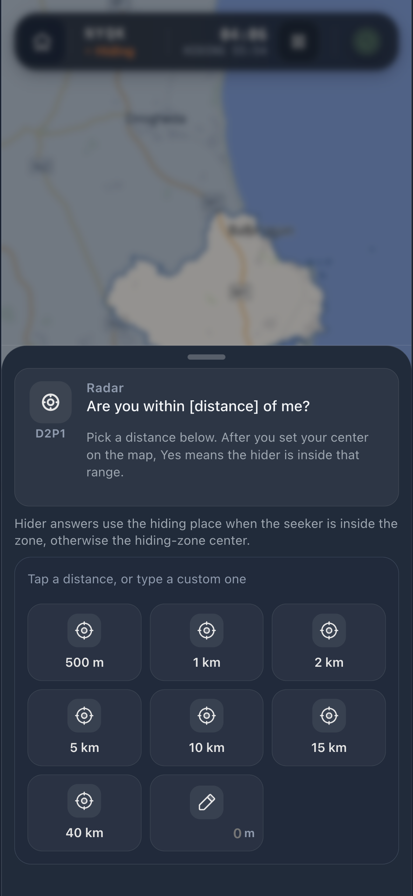
  

  
👥 Social & presets

  

    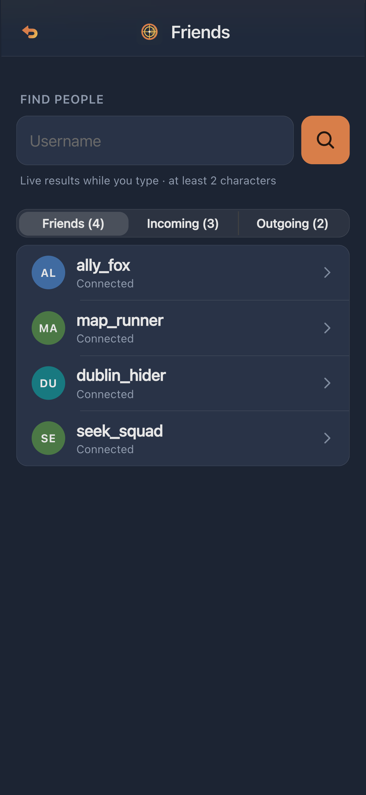
    &nbsp;
    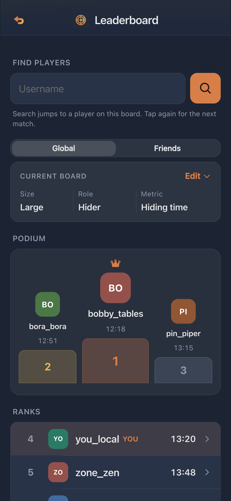
    &nbsp;
    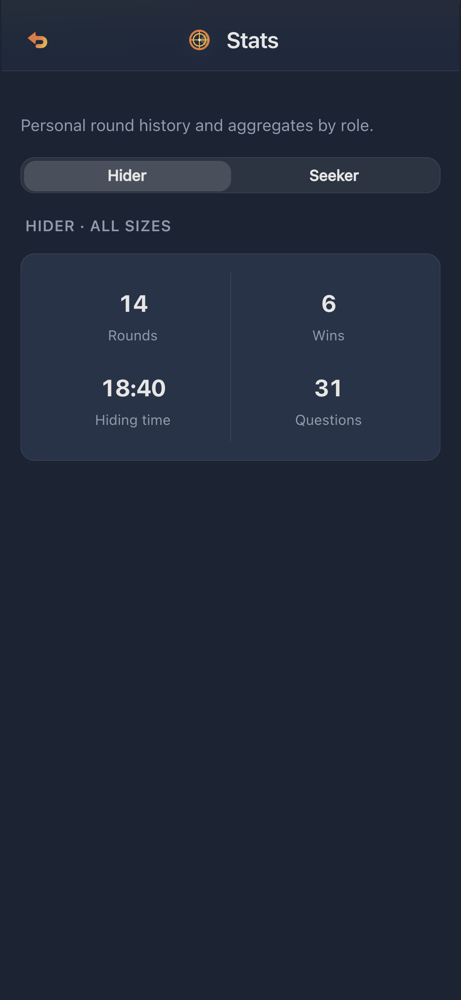
    &nbsp;
    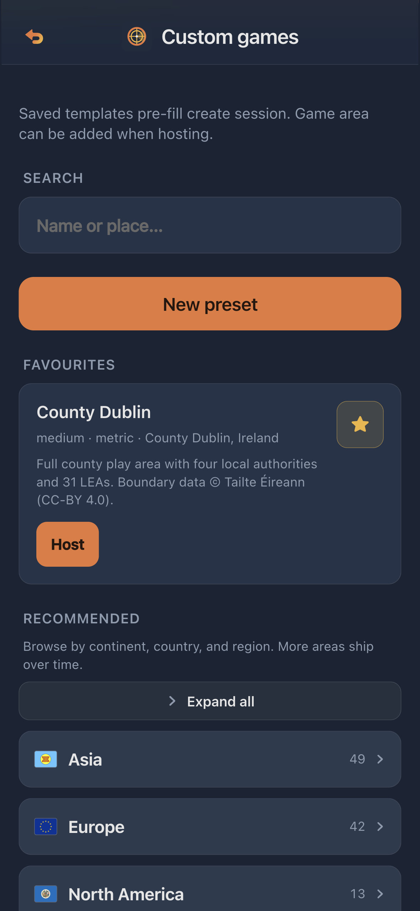
  

## How to play

1. A host creates a session, frames the play area, and shares the 4-letter code.
2. Seekers and hiders join on their phones and pick a role.
3. The shared map updates live as questions are asked, zones are drawn, and hiders place their hiding zone.

## Map tools

Question tools sit on the bottom bar:

- **Matching.** Same category on the map?
- **Measuring.** Closer or further?
- **Thermometer.** Hotter or colder?
- **Radar.** Inside or outside a circle?
- **Tentacles.** Point-to-point questions.

Markup tools live under **Draw**:

- **Zone.** Draw a play boundary.
- **Pin.** Mark a point on the map.

## On your phone

Built for players on the move. Big touch targets, readable outdoors, one-handed use. Add it to your home screen for a full-screen map (PWA).

## About

Unofficial fan companion for [Jet Lag: The Game](https://jetlagthegame.com/). Not affiliated with the show, board game, or Nebula.

## Official Jet Lag

- [Jet Lag: The Game on YouTube](https://jetlagthegame.com/)
- [Hide + Seek board game (Nebula Store)](https://store.nebula.tv/products/jet-lag-the-game-hide-and-seek-transit-game)
- [Expansion rules reference](https://rules.jetlagthegame.com/expansion/)

## Contributing

Want to fix a bug or land a small improvement? See [CONTRIBUTING.md](CONTRIBUTING.md) for Node version, Doppler/`just` setup, tests, and changesets.
