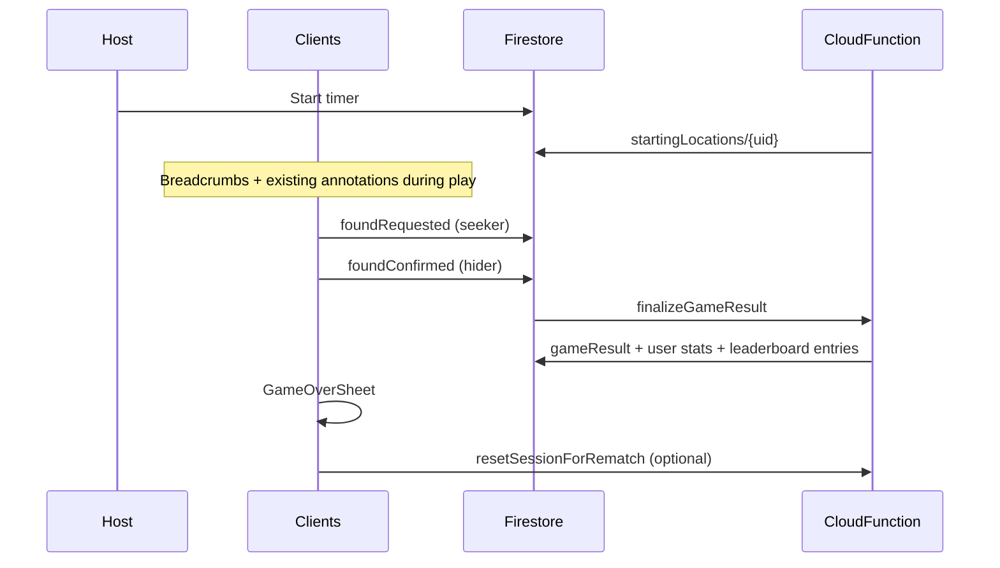

# Game over, stats, friends & leaderboards

Date: 2026-07-14  
Scope: Multiplayer Firestore sessions only (not local/offline)  
Phases: 4 (core loop → auth/stats → friends → leaderboards) — single implementation push per scope lock

## Problem statement

When a round ends today, seekers can request end-game (zone reveal) but there is no “found hider” outcome, no persisted stats, no game-over debrief, and no social/leaderboard surfaces. Players need a post-game experience with map replay, rematch with role swap on the same session code, signed-in profiles, friends, and opt-in leaderboards split by game size and role.

## Success criteria

- Timer start snapshots every member’s GPS into `startingLocations`.
- Location breadcrumbs during play enable distance stats (throttled, capped).
- Seekers can declare **Found hider**; any hider confirms → server-finalized `gameResult`.
- **GameOverSheet** + **MapReplayLayer** show outcome, hero metric, phase split, tool question stats, and actions (rematch primary).
- **Same-session rematch**: swap seeker↔hider roles, archive round to `sessions/{id}/rounds/{n}`, reset timer/map state atomically via Cloud Function.
- Signed-in users with display name can save personal history; opt-in global/friends boards (default off).
- Home: Friends + Leaderboard header icons; **PlayHubSheet** consolidates Create / Join / Custom game.

## Out of scope (v1)

- Local session stats or leaderboard
- Per-hider separate found confirmations
- New session code on rematch
- Instant friend-add without request
- Anonymous persistent stats
- Share as image export (copy text/link only)
- Auto-finalize on disconnect

## Architecture (recommended: server-finalized stats)

Clients write **facts** (starting snapshots, breadcrumbs, found-hider handshake). Cloud Functions compute canonical stats on completion.

### Firestore additions

| Collection / field | Purpose |
|--------------------|---------|
| `sessions/{id}/startingLocations/{uid}` | lat, lng, accuracyMeters?, role, capturedAt |
| `sessions/{id}/locationBreadcrumbs/{uid}/points/{autoId}` | Throttled trail (≥50m or ≥60s; cap ~500/player) |
| Session doc: `foundRequested*`, `foundConfirmed*`, `gameOutcome`, `gameResultId` | Parallel to end-game flags |
| `sessions/{id}/gameResult` | Server-computed round summary |
| `sessions/{id}/rounds/{n}` | Archived finished rounds |
| `users/{uid}/profile/main` | displayName, leaderboardOptIn |
| `users/{uid}/gameHistory/{sessionId}` | Personal history |
| `users/{uid}/stats/{seeker\|hider}` | Aggregates |
| `leaderboard/global\|friends/{...}` | Opt-in ranked entries |

### Cloud Functions

- `captureStartingLocations` — on first `runningSince` transition
- `finalizeGameResult` — on found confirm or ended_early
- `resetSessionForRematch` — transactional reset + role swap + round archive
- `profileFriends` — display-name search, requests, accept/decline (rate-limited)

### Found hider vs end game

| Flow | Seeker | Hider | Result |
|------|--------|-------|--------|
| End game | “Start end game” | “Seekers requested end game” | Zone phase; map mask |
| Found hider | “Found hider” | “Seekers say you're found” | Round over → GameOverSheet |

Distinct border tints: end-game `border-highlight`; found `border-status-success`.

## UI / UX design brief

Register: **product** (HUD panels over map, not a separate stats app). Committed color on game-over headline and rematch CTA; restrained elsewhere.

### Surface map

| Surface | Container | Primary action |
|---------|-----------|----------------|
| FoundHiderAlert | MapFloatAlertPanel | Hider confirm / decline |
| GameOverSheet | AnimatedOverlay bottom sheet | Switch roles & rematch |
| MapReplayLayer | Full-screen over map | Pan/zoom replay |
| AccountSignInGate | Inline sheet on save | Sign in → display name |
| StatsDashboard `/stats` | EntryScreenLayout | Role tabs |
| Leaderboard `/leaderboard` | EntryScreenLayout + sticky filters | Scope × size × role × metric |
| FriendsPanel `/friends` | Entry route + sheet entry points | Add / invite |
| PlayHubSheet | AnimatedOverlay from Home | Create / Join / Custom |

### Home IA

Header cluster (top-right): `[Admin?] [Tutorial] [Friends] [Leaderboard] [vX.X]`

Action order:

1. Continue (if active session) — primary
2. Play — opens hub
3. Premium (if Firebase)
4. Legal footer

Remove direct `/create`, `/join`, `/presets` links from Home surface (routes unchanged).

### GameOverSheet layout (mobile-first)

- Handle + outcome headline (role-aware hero metric in mono)
- Scroll: phase strip, labeled stat rows (no card grid), questions-by-tool list, mini map thumb
- Pinned footer: rematch primary; save / share / leaderboard secondary; home tertiary
- Host “End session for all” tertiary in scroll body

### Anti-goals

- Generic SaaS game-over (cream bg, 3-column stat cards)
- Nested cards, side-stripe borders, gradient text
- Modal dialogs where sheets fit
- Motion-gated stats content

### Motion & a11y

- Sheet: `hud-sheet-enter` / `hud-sheet-exit` (280ms); scrim `hud-scrim-enter`
- Hero metric count-up only when `decorativeAnimate`; respect `prefers-reduced-motion`
- Touch targets ≥ 44px; z-index scrim/sheet `--z-modal` (1100)

## Implementation phases

**Phase 1 — Core game loop**

- Starting location capture on timer start
- Location breadcrumbs
- Found hider request/confirm + `finalizeGameResult`
- GameOverSheet, MapReplayLayer, FoundHiderAlert
- Same-session rematch + round archive

**Phase 2 — Accounts & personal stats**

- AccountSignInGate + display name (required to save)
- Personal history on game-over; `/stats` dashboard
- Home refactor: PlayHubSheet + header icons

**Phase 3 — Friends & invites**

- `/friends` route: list, search, requests, invite-to-session

**Phase 4 — Leaderboards**

- Opt-in prompt; global + friends boards — 7 metrics × size × role

Each phase gets a changeset when player-visible.

## Key files

| Layer | Files |
|-------|-------|
| Domain | `src/domain/game/gameResult.ts`, `foundHider.ts`, `playerProfile.ts`, `leaderboard.ts` |
| Firestore | Extend `firestoreSessionExtras.ts`; new `firestoreGameResult.ts`, `firestoreProfile.ts`; `firestore.rules` |
| Functions | `finalizeGameResult.mjs`, `resetSessionForRematch.mjs`, `captureStartingLocations.mjs`, `profileFriends.mjs` |
| Hooks | `useFoundHider.ts`, `useGameOver.ts`, `useLocationBreadcrumbs.ts` |
| UI | `FoundHiderAlert`, `GameOverSheet`, `MapReplayLayer`, `PlayHubSheet`, Home header icons |
| Routes | `/friends`, `/leaderboard`, `/stats` |

## Risks

| Risk | Mitigation |
|------|------------|
| Missing GPS at timer start | Host warning; 60s retry window |
| Breadcrumb storage | Throttle + cap; TTL cleanup |
| Rematch race conditions | Transactional `resetSessionForRematch`; `roundNumber` bump for resubscribe |
| Found vs end-game confusion | Distinct copy + border colors |

## Verification

- [ ] Seeker found flow → hider confirm → GameOverSheet with correct hero metric
- [ ] Map replay shows start pins + trails + zone
- [ ] Rematch swaps roles on same code; prior round archived
- [ ] Anonymous can view game-over; save requires sign-in + display name
- [ ] Leaderboard opt-in default off; global shows display name + stat only
- [ ] `node .cursor/scripts/component-reuse-audit.mjs` on touched UI routes
